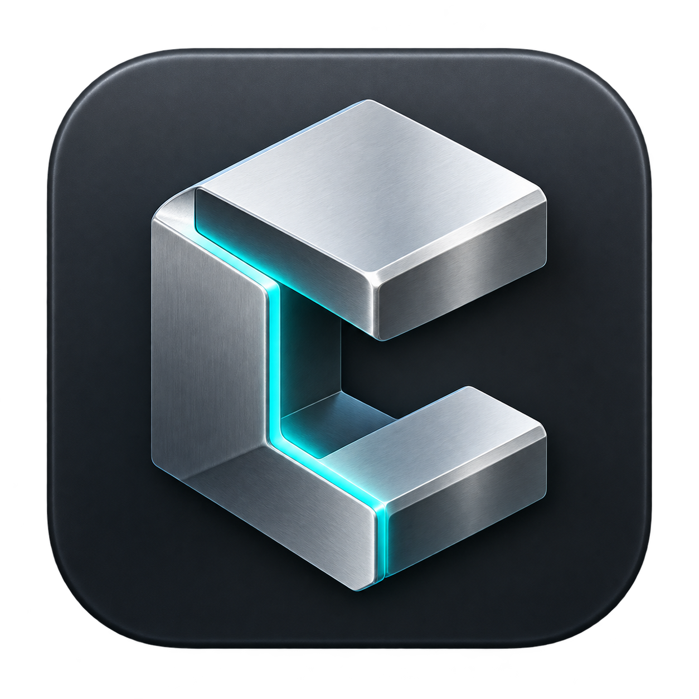
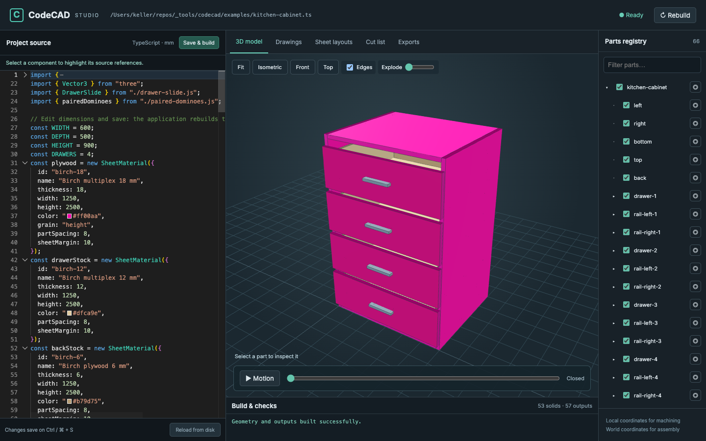

# CodeCAD Studio

<p align="center">
  
</p>

A local TypeScript CAD application with classes, standard decorators, automatic
part registration, an OpenCascade geometry engine, live preview, and manufacturing
outputs.

Sheet parts can be oriented and connected by named edges instead of repeating
world-coordinate transforms. Edges are `north`, `south`, `east`, or `west` in the
panel's own width/height plane; `front` is the positive-thickness face and
`back` is the zero-thickness face:

```ts
const left = plywood
  .makePart({ id: "left", width: 220, height: 300 })
  .orient("YZ", { x: 0, y: 0, z: 0 });
const bottom = plywood
  .makePart({ id: "bottom", width: 220, height: 200 })
  .attach({
    own: { edge: "west", face: "front" },
    to: left.edge({ edge: "south", face: "front", from: 6, length: 200 }),
    rotate: { x: 90, z: 180 },
  });
```

`edge()` can also select `inset` and a bounded `from`/`length` span. It returns
a normal `PartInterface`, so the same reference works with `FingerJoint` and
other existing techniques. `attach()` aligns the selected edge origins; its
optional offset is measured in the target edge frame. Without an explicit
rotation, the moving panel goes on the opposite side of the edge in the same
plane. `orient()` places the local panel origin in parent coordinates; for an
XZ panel its thickness extends toward negative Y. The existing `place()` API
remains available.

`ManufacturingDxf` checks what the cutter would leave behind when given
`minimumMaterial`: every part whose narrowest stretch of material — between two
cuts, or between a cut and the blank's edge — falls below it is reported as a
`THIN_MATERIAL` warning naming the part, the two contours and where on the blank
they close in. It is sampled about every millimetre, so it is a check rather
than a proof, and it catches what the joint rules cannot: a pocket that runs
into an edge, or a hole placed too near a notch.

`ManufacturingDxf` can also put its CAM geometry on the Drawings plane with
`showInDrawings: true`: the same contours the DXFs carry — blank outlines, cut
contours and drilled holes — laid out the way the files are, nested sheets or
the parts in a row, each labelled with the part it came from and coloured by
layer. Arcs are sampled into the plane's paths, so a rounded blank or a slot
keeps its shape. It costs a full section pass even when exports are lazy,
because the plane is part of the model rather than a file.

Projects can define geometry for the infinite **Drawings** workspace,
independent of printable plans. Add paths, lines, or circles in millimetres
from a project constructor. Drawings remains available even for an empty plane,
and configured plans can be downloaded there. See `examples/infinite-drawing/index.ts`:

```ts
this.view2D.path(
  [
    { x: 0, y: 0 },
    { x: 600, y: 0 },
    { x: 600, y: 900 },
    { x: 0, y: 900 },
  ],
  { closed: true, label: "Front outline" },
);
this.view2D.circle({ x: 300, y: 450 }, 12, { label: "Pull" });
```

The **Sheet editor** in Drawings composes an A3 sheet without editing project
code. Add a view of the model or of one part (▣), pick the side it is seen from,
its scale and whether hidden edges are dashed, then drag it into place or resize
its frame. Each view lists the parts under its subject with a checkbox, so one
sheet can show the carcass without the doors while another shows the door alone;
switching a part off takes its children with it, and the choice applies to the
live preview and to the built PDF and DXF alike. Scroll to zoom the sheet around
the cursor, drag its empty background (or hold the middle button) to pan, and use
−, + and ⛶, or the `-`, `+` and `0` keys, for the same from the toolbar.
A plan can hold several sheets: the tabs above the page switch between them,
**+** adds one, and a sheet's title and **Delete sheet** are shown when nothing
on it is selected. Every sheet that has something on it becomes a page of the
same PDF and DXF. **Place part** (◫) lists the parts the **2D geometry** tab
shows (the sheet parts of a `ManufacturingDxf` with `showInDrawings: true`) and
places one as it is cut, from the same outline, drill and cut geometry; it can be
turned, scaled and dimensioned like any other view.
**Measure** (the ruler, the same tool as in the 3D view) takes three clicks:
two targets, then where the dimension line goes, with the live distance and a
preview until it is placed. A target is a corner or a whole edge: two corners
give their distance, an edge and a corner the perpendicular distance from the
edge's line to the corner, two parallel edges the gap between them, and the
same edge twice its length. Hold Shift to pick a point along an edge instead.
The measured points are stored in the view's model coordinates, so the value is
exact, follows the view when it moves, and updates when the design changes. Drag a dimension to slide
its line, press Delete to remove the selection, Esc to cancel a tool, and the
arrow keys to nudge (Shift for 10 mm). **Save plan** (Cmd/Ctrl+S while the editor
is open) writes a `<project>.drawings.json` recipe beside the project source and
rebuilds. The sheet is then a regular build output: true hidden-line views in
the editor, and a titled PDF and DXF under **Sheets** and in command-line builds.
Views whose part no longer exists are reported as build warnings.

**Sheets** shows every drawing of the project, coded or composed, as the real
PDF pages with their download controls.

Drag to pan the unbounded grid, scroll to zoom around the cursor, and use Fit to
reframe project geometry. The infinite view itself does not create an export file;
add a technical drawing output for a printable plan.



## Use as a library

The published package is `@tobisk/codecad`: the generic TypeScript CAD SDK, not
the desktop application or its examples. Install it in an independent project:

```sh
npm install @tobisk/codecad
```

Then author reusable parts or an entire model in that project's source tree:

```ts
import { cad, Project, SheetMaterial } from "@tobisk/codecad";

@cad.project({ id: "shelf", units: "mm" })
export class Shelf extends Project {
  constructor() {
    super();
    const plywood = new SheetMaterial({ thickness: 18 });
    plywood.makePart({ id: "side", width: 300, height: 700 });
  }
}
```

`npm run package:check` emits the public library and imports it through the same
package export map a consumer receives. `npm pack --dry-run` shows the exact
publish payload; it contains only `dist/`, the README, and license notices.

### Build the desktop app through npm

The package also exposes an explicit macOS launcher/build command:

```sh
npx @tobisk/codecad app
```

It downloads the source archive for the matching `v<package-version>` Git tag
from GitHub into `~/Library/Caches/CodeCAD/source/`, builds the Tauri app with
the local Xcode, Rust and Node toolchains, and opens it. A previously built copy
is opened directly; use `npx @tobisk/codecad app --rebuild` to build it again.
This command still builds locally; it does not download the GitHub Release ZIP.

## Releases

GitHub is the release authority. Pull requests and pushes validate with
`npm run check`, `npm test`, and `npm run package:check`. A trusted push to
`main` runs semantic-release on a macOS runner. It prepares one version across
the npm package, lockfile, Tauri configuration, and Rust crate, updates
`CHANGELOG.md`, builds a macOS archive, commits those version files, and creates
a `vX.Y.Z` tag. It then publishes `@tobisk/codecad` through npm trusted
publishing (OIDC) and creates a hosted GitHub Release with the macOS ZIP and
SHA-256 checksum. The archive is ad-hoc signed and not notarized; macOS may
require an explicit trust override before opening it.

Conventional Commit messages control versioning: `fix:` and `perf:` publish a
patch, `feat:` publishes a minor, and `type!:` or a `BREAKING CHANGE:` footer
publishes a major. `docs:`, `test:`, `style:`, `refactor:`, `build:`, `ci:` and
`chore:` do not release by themselves. Run `npm run release:dry-run` locally to
preview a release without publishing.

The existing npm trusted publisher for `@tobisk/codecad` must name this GitHub
repository and `.github/workflows/release.yml`; the repository variable
`NPM_PUBLISH_ENABLED` must be `true`. Until it is set, the entire release job is
intentionally skipped. No `NPM_TOKEN` is stored in GitHub. The release job needs
GitHub `contents: write` for the release commit, tag, and hosted assets, and
`id-token: write` for npm OIDC. Only the trusted `main` release job receives
those permissions. A fresh checkout with full history and tags is required for
semantic-release. Run `npm run release:dry-run` locally to preview versioning;
it does not build an archive or publish anything. CI runs the build only after
tests pass and semantic-release finds a releasable commit.

## Run

### Desktop app (Tauri)

The repository-root wrapper builds the complete macOS application, including its
icon, web assets, native shell, bundled Node runtime and TypeScript 7 compiler:

```sh
./build                  # bootstrap dependencies and build
./build open             # rebuild and launch the build-directory app
./build install          # rebuild, replace /Applications/CodeCAD.app, and launch
./build archive          # clean app release build and macOS ZIP in artifacts/
./build archive install  # archive, replace the installed app, and launch
```

It works from other working directories too. ZIP filenames include the version
and host architecture; these are host-architecture macOS builds, not universal,
Windows or Linux packages. Native dependency caches are retained; archive builds
clean the CodeCAD crate. Node 22+, Rust and Apple Command Line Tools are required;
missing Node/Rust can be installed through an existing Homebrew installation.
If Homebrew or Apple's installer needs user action, the wrapper explains how to
continue. Locked npm dependencies are installed when their fingerprint changes.

Install validates the bundle ID, stages and verifies the new app before stopping
the exact old process, and preserves an existing app at the printed hidden
`/Applications/.CodeCAD-previous-...app` path. Project files and application data
are not removed. `/Applications` must be writable. Builds use local ad-hoc signing
unless `CODECAD_SIGN_IDENTITY` is set; no notarization is performed.

The macOS app has a custom draggable window frame with minimize, maximize/restore
and close controls. **Open from disk…** on the welcome screen opens a native file
picker for a project's `.ts` or `.mts` entry file, and **Open a project folder…**
(Shift+Cmd/Ctrl+O) takes a folder and opens the `index.ts` inside it. In Studio,
the project picker offers the same two under **Entry file** and **Folder**.
Recent projects and examples are shown directly on the welcome screen with model
previews. Cmd/Ctrl+O opens the project picker from the editor. Opening a new
project executes local TypeScript and asks for trust the first time only.

Up to eight projects stay open at once, each with its own CAD engine, and the
tab strip at the top of the window switches between them. Cmd/Ctrl+T opens
another project, Cmd/Ctrl+1 … 9 jump to a tab, and a tab's × closes that project
and stops its engine. Opening a project that is already open raises its tab
instead of starting a second engine. The home button returns to the welcome
screen while every project keeps running; closing the window stops all of them.
The sidebar button next to it hides or shows the code completely. View
presets, parallel/perspective projection, and contextual measurement are in the
same toolbar. Hold Shift near a circular edge to measure from its hole centre.
**Build & checks** shows build status and can copy its output for bug reports.

The welcome screen also offers editable copies of the cabinet, keyboard and
apartment examples with previews rendered from their actual models. Copies live
in the application's data directory, separate from bundled resources. Recent
project previews are captured after a successful build. The app bundles Node.js,
OpenCascade and its TypeScript tools; users do not need a separately installed
Node runtime.

To develop/build, install Node.js 22+, Rust and the platform's Tauri prerequisites
(Xcode Command Line Tools on macOS), then run:

```sh
npm ci
npm run desktop:dev
# Or build the macOS application:
npm run desktop:build
```

The app is written to `src-tauri/target/release/bundle/macos/CodeCAD.app`.
Preparation downloads an official Node 22 runtime and checks its SHA-256 against
the published manifest. Subsequent builds reuse the cached runtime. Only macOS
has been built and tested; Windows runtime packaging is not implemented. The
local build is not a signed/notarized distribution release.

### Browser development

Requires Node.js 22 or newer.

```sh
npm ci
npm run dev
```

Open **http://127.0.0.1:4317**. The default project is
[the four-drawer cabinet](examples/kitchen-cabinet/index.ts).
Edit its source in the application and press **Save & build** (Cmd/Ctrl+S), or save
from your usual editor. Changes to project-directory and runtime TypeScript files
trigger a fresh build. Changes to Studio itself (`web/`) rebuild its bundle
while the server runs, a change to `src/server.ts` restarts the server, and
the open page reloads to pick either up unless the editor holds unsaved
edits. Select parts, hide panels, inspect drawings and
sheet layouts, scrub drawer motion, or download the generated files.

The Parts registry is an expandable ownership tree (also available as
`project.registry.tree` and `project.parts.tree`). Selecting or hiding an assembly
affects its descendants; filtering keeps matching nodes and their ancestors.
At smaller window sizes, use the **Parts** and **Source** buttons.
Each row's **Show only** control isolates that component and its descendants,
fits the visible geometry, and centers the orbit target. **Show all** restores
the complete model; **Fit** always fits currently visible geometry.

The Monaco TypeScript editor provides syntax highlighting, completion, and folded
imports on load. Type an unimported symbol and accept its **Auto import** completion
(Ctrl+Space opens suggestions) to insert or merge the import. This uses a local
TypeScript language service, not a cloud service.

Component selection highlights construction, placement, machining callsites and
lexical references in the open project file. Reused definitions share highlighted
lines; copied recipes retain their original construction locations. This is
source provenance, not exhaustive dataflow analysis: indirect dependencies and
code in other files are not all highlighted in the current single-file editor.
Unsaved edits clear build-linked highlights until the next save and rebuild.
The sample's three-member slides are cabinet-owned and its handles are single solids;
hardware expands further when authored as an assembly with child components.

The cabinet example opens each drawer over 3 seconds, starting successive drawers
0.75 seconds apart (25% of the opening duration). `delaySeconds` is also available
on `MotionStudy.animate`. Each provisional slide has a stationary `fixed` member,
a `middle` member moving 190 mm, and an `inner` member moving the drawer's full
380 mm. These are kinematic envelopes, not manufacturer-qualified slide profiles.

Paired domino mortises join the corpus sides to the top/bottom (20 × 6 mm,
10 mm deep per side, three per joint) and drawer sides to their backs (16 × 4 mm,
6 mm deep per side, two per joint). Tenon solids are not included. Edge-entry
mortises require a separate machining setup: the CNC ZIP includes `-edge-X_MIN`
and `-edge-X_MAX` DXFs with along-edge horizontal coordinates and stock thickness
vertically, in millimetres. Sheet-face DXFs carry reference notes rather than
misrepresenting these mortises as face-routing pockets.

To open another project:

```sh
npm run dev -- examples/sheet-metal-project/index.ts
npm run dev -- examples/joinery-techniques/index.ts
npm run dev -- examples/small-apartment/index.ts
```

The apartment example has an 8 x 6.4 m footprint and approximately 43.70 m2 of
clear room floor area: hallway, L-shaped living/kitchen, bedroom and bathroom.
All four rooms have exterior windows. The entrance has a door; the 1000 mm
hall-to-living opening has no door. PDF/DXF plans include a north-up floor plan
cut at 1400 mm, door-swing symbols and a cutaway isometric page. The 3D model
retains full-height walls. It is a spatial concept, not a construction/permit plan.
`DrawingView.cutHeight` clips only the drawing; `drawing.path()` and
`drawing.label()` place symbols and labels in world coordinates in a named view.

For exports without the viewer:

```sh
npm run build
node --import tsx src/worker.ts examples/sheet-metal-project/index.ts output/sheet-metal
npm run check
npm test
```

The default build writes to `output/kitchen-cabinet/`. Live-build artifacts are
stored under `.codecad/`. Project source runs as trusted local Node.js code,
with your account's filesystem access. Use projects you trust.

### Browser editor (in development)

A browser editor for projects built without code is taking shape in `app/`
(see [the roadmap](docs/full-cad-roadmap.md)). Its projects are stored in
`.codecad/workspace.sqlite`. Every save keeps a new revision, and a save based
on an outdated revision is refused instead of overwriting the other change.

```sh
npm run dev        # the CodeCAD server, as above
npm run app:dev    # the editor with hot reload: http://localhost:5173/app/
npm run app:build  # or build it once; the server then serves /app/
```

**Variables** are listed beside the sketch.

- Each variable has a name and an expression, such as `600`,
  `width - 2 * thickness`, `18mm`, `max(300, depth / 2)` or `45deg`.
- Its current value is shown next to it, or the reason it has none: a syntax
  error, an unknown name, or a circular reference.
- Variables can have a unit and a type (number, yes/no, or a choice), and can
  be grouped.
- Renaming a variable renames every use of it.

**Sketches** are drawn on the XY, XZ or YZ plane, or on a flat face of a
body: click the face in the 3D view, then **Sketch on face**. The face's edges
are drawn in the sketch as dashed reference lines, and points snap to them.

- **Tools:**
  - Line (L), Rectangle (R), Circle (C), Arc (A) and Slot (S) draw geometry.
    Points snap to existing points, lines and the grid.
  - Lines drawn within 3° of horizontal or vertical get that constraint
    automatically.
  - Trim (T) cuts away the clicked piece of a line.
- **Selecting:** click to select geometry, and Shift adds to the selection. The
  row under the tools then offers:
  - constraints: horizontal, vertical, parallel, perpendicular, equal,
    tangent, coincident, on, midpoint, symmetric, fix
  - dimensions: distance, horizontal and vertical distance, angle, radius,
    diameter
  - offset, construction (X) and delete.
- **Dimensions:** a new dimension opens for typing a number or an expression,
  and double-clicking a dimension edits it again.
- **Dragging:** dragging a point moves it as far as the constraints allow.
- **Status:** the status line says how many degrees of freedom are left. It
  also lists conflicting constraints (shown in red), redundant ones (orange)
  and dimensions whose expression fails. Closed regions are shaded, including
  holes; these are the profiles a later extrude will use.
- **Keys:** Ctrl/⌘+Z and Shift+Ctrl/⌘+Z undo and redo any change, to variables
  or sketches alike, and Ctrl/⌘+S saves.

**Bodies** come from features, which are built in the order the feature list
shows. The toolbar above the 3D view adds them where the rollback bar is:

- **Extrude** sweeps regions of a sketch. It can make new bodies (one per
  region), add to bodies, cut them, or keep only the overlap. It goes a
  distance, symmetrically both ways, through everything, or up to a picked
  face.
- **Hole** drills at the points of a sketch that belong to no line or curve:
  simple, counterbored or countersunk, to a depth or through.
- **Fillet** and **Chamfer** round or bevel edges picked in the 3D view.
  **Shell** hollows a body, leaving the picked faces open.
- **Pattern** repeats extrudes, holes or whole bodies in a row or around an
  axis, and **Mirror** repeats them across a plane.

Every number is an expression, so features follow the variables. Faces and
edges are remembered by the feature and the sketch line that made them (the
face swept by line `l3` of an extrude, the top of a cut), not by position:
after a dimension changes, a sketch on a face stays on that face. A face that
no longer exists is never replaced by another one. The feature that used it
shows "broken reference" instead, and you pick the face again.

- **Feature list:** select a feature to edit its form, double-click a sketch to
  draw in it, move features up or down (a feature cannot move before what it
  uses), suppress them, or roll back to one. Only the features after an edit
  are rebuilt.
- **Joint:** click two touching parts. The editor works out how they meet: at
  a corner, as a T, edge to edge, face to face, or crossing. It then offers only
  the joints that fit that:
  - finger joints
  - dominos (4×20 to 10×50)
  - dowels
  - screws, countersunk from the outside
  - dados and rabbets
  - miters
  - half-laps.

  The joint is worked out again every time the model is built, so it follows
  the panels when their dimensions change.

- **Mate** moves a part by laying one of its faces against a face of another
  part. The faces can be centred, or have an edge lined up with another edge,
  flush at its start, middle or end. **Move** shifts or turns parts, or places
  moved copies of them.
- **Measure** gives the distance or angle between two points, edges or faces.
- **Parts:** each body is a part with a name, a quantity, a material and a
  stock kind. Add the sheet materials you have under **Materials**. A body
  extruded exactly as deep as a sheet material is thick is sheet stock without
  being told, and so is a rectangular panel drawn edge-on whose other side has
  that thickness. Sheet parts go through the cut list, nesting and DXF output:
  holes become circles on drill layers, and pockets become contours at their
  depth. Dominos and holes drilled into an edge are separate edge setups: a
  note on the face drawing, and a drawing of that edge. The parts panel lists
  the dominos, dowels and screws the joints need, and downloads the bill of
  materials as CSV.

The CAD kernel runs in the browser, in a Web Worker. `/kernel-probe` shows
how long it takes to load and build a part on the current machine. The API
is `GET/POST /api/projects` and `GET/PUT/DELETE /api/projects/<id>`. A `PUT`
names the revision it was `basedOn` and gets `409` if another save came first.

### Network access

The server listens on 127.0.0.1 only. To reach it from other devices, such as
a phone in the workshop, start it with `CODECAD_HOST=0.0.0.0 npm run dev`. It
then prints its LAN address.

- **Host check:** requests must still be addressed to this machine by name or
  address. List any other names, for example a reverse proxy's, in
  `CODECAD_ALLOWED_HOSTS=cad.home.arpa,other.name`.
- **Changes:** they need the page's session token, and must come from a page
  served under the same address.
- **Project source:** the TypeScript that the server compiles and runs can only
  be changed from this machine.
- **Users:** there are no user accounts yet. Only open the server on networks
  you trust.

## Authoring

### Material drawing styles

Materials can define regular edge styling and a separate cutaway style:

```ts
const wall = new BlockMaterial({
  name: "Plastered wall",
  drawingStyle: {
    regular: { stroke: "#555555", lineWidth: 0.18 },
    cutaway: {
      stroke: "#202020",
      lineWidth: 0.5,
      hatch: { angle: 45, spacing: 1.8, stroke: "#777777", lineWidth: 0.13 },
    },
  },
});
```

`cutaway` applies to actual faces exposed by a drawing view's `cutHeight`, not
the entire clipped part. Openings remain unhatched. Use `cross: true` inside
`hatch` for cross-hatching, or `hatch: false` to show only the cut outline.
Widths and spacing are in **paper millimetres**, angle is in degrees on the page,
and colours are six-digit hex values. Styles affect drawings, not 3D materials
or CNC toolpaths. Regular styles also apply to developed sheet-metal drawing
outlines. Cut edges inherit unspecified regular line settings; hatch defaults
are 45°, 2 mm spacing and 0.13 mm line width.

SVG previews and PDF use the same vector geometry. DXF stores clipped hatch
segments on `SECTION_HATCH_*` layers (not native editable HATCH entities), with
true colour and the nearest supported DXF line weight. The apartment demo uses
this for its walls. Joined generic solids do not inherit source material styles.

### Joining solids

Use `this.joinSolids([floor, leftWall, rightWall], { id: "shell" })` in a
project or assembly to fuse placed parts (including whole nested assemblies).
Their current world positions are captured in the owning assembly's coordinate
system. The returned `Part` can be drilled, cut, moved, copied or exported to STEP.
Source components are removed from the registry and exports by default; pass
`keepSources: true` to retain them deliberately. Later source edits do not change
the joined snapshot. References to consumed components retain their original
world placement, but are no longer independently animated/exported.

For additive edits in a part's **local coordinates**, use
`part.union(new Shapes.Box({ width: 10, depth: 10, height: 10 }), { x: 20 })`.
To union another placed part without consuming it, use
`part.union(other, { relativeTo: other })`.

See [the joined room shell](examples/joined-solids/index.ts). Overlapping or face-touching
inputs can form one solid; disconnected inputs remain separate bodies within one
part. Joining does not bridge gaps or guarantee printability. Material, cut-list,
bend and machining metadata are not merged; folded sheet metal is explicitly
rejected to avoid joining its flat blank by mistake. This is a geometric union,
not a woodworking joint or a slicer/toolpath generator.

```ts
@cad.project({ id: "cabinet", units: "mm" })
export class Cabinet extends Project {
  constructor() {
    super({ id: "cabinet" });
    const material = new SheetMaterial({
      width: 1250,
      height: 2500,
      thickness: 18,
    });
    const left = material.makePart({
      id: "left",
      width: 600,
      height: 900,
    });
    new Drill({ size: 8 }).drill(left, {
      x: 50,
      y: 100,
      z: [18, -6],
    });
    left.copy({ id: "right" }).place({
      relativeTo: left,
      x: 600,
    });
  }
}
```

Outputs may stay on the project or live in separate classes. A class decorated
with `@cad.outputsFor(Cabinet)` receives the active `Cabinet` instance in its
constructor, so drawings, lists, exports, and motion refer to the same built
assembly and parameter values rather than constructing a second copy:

```ts
@cad.outputsFor(Cabinet)
export class CabinetCutList {
  constructor(readonly cabinet: Cabinet) {}

  @cad.output.cutList({ fileName: "cut-list.csv" })
  cutList() {
    return new CutList({ includeLayouts: true });
  }
}
```

See [the kitchen cabinet](examples/kitchen-cabinet/index.ts) for separate drawing,
manufacturing, and motion provider classes. The project entry still exports
exactly one decorated `Project` subclass.

Provider classes can live in **their own modules**: one file that assembles the
model, and a file each for the drawings, the CAM output and every motion study.
An output module imports the project it belongs to, and the project imports the
output modules so their decorators run, which makes the two modules import each
other. Pass the project as a function to defer reading the class until the build
matches providers, and the cycle is harmless:

```ts
// tray-drawing.ts
import { Tray } from "./tray.js";

@cad.outputsFor(() => Tray)
export class TrayDrawings {
  constructor(readonly tray: Tray) {}

  @cad.output.technicalDrawing()
  drawing() {
    return new TechnicalDrawing({ title: "Tray" }).standardViews(this.tray);
  }
}
```

```ts
// project.ts — the assembly
@cad.project({ id: "tray", units: "mm" })
export class Tray extends Project {
  /* assembles the parts */
}
```

```ts
// index.ts — the entry
import type { ProjectInfo } from "@tobisk/codecad";
import "./tray-drawing.js";
import "./tray-motion.js";

export * from "./project.js";

export const PROJECTINFO: ProjectInfo = {
  name: "Sliding tray",
  author: "Workshop",
  description: "One tray on a linear slide, with its sheets and motion study.",
  revision: "A",
};
```

A project is a folder whose `index.ts` is the entry: it imports the modules that
make up the project, re-exports the project class so the build still finds
exactly one, and names the project in `PROJECTINFO`. Studio's header shows that
`name` (with the description, author and revision on hover) as soon as the
project builds, and drawings the build composes itself — the standard sheet and
the one from the Sheet editor — take `PROJECTINFO` as their PROJECT, DRAWN BY
and REV title-block fields, while drawings written in project code keep whatever
they set. `PROJECTINFO` is optional: an entry without one is titled by its
project class as before. A sheet composed in Studio is saved as `drawings.json`
beside an `index.ts` entry, and as `<entry>.drawings.json` for any other entry
file.

`@cad.outputsFor(Tray)` still works where no cycle exists, for instance when a
thin entry module imports the assembly and the output modules and re-exports the
project. A reference that is neither a project class nor a function returning one
is refused, naming the provider.

Each output method writes its own file, so several studies or sheets can coexist:
a `@cad.output.motion()` method writes `<method name>.glb` unless it names a
`fileName`, and two outputs claiming the same file name is reported instead of
one silently overwriting the other. See
[the modular example](examples/modular/index.ts) with its drawing,
manufacturing and motion modules.

### Registry and construction

- Classes decorated with `@cad.project` or `@cad.part` create a construction
  scope. Every component created in that scope becomes a child of that project
  or assembly. Temporary `Shapes` and tools are not registered as manufactured
  parts.
- Local variables are sufficient; parts need no repeated class fields or manual
  registration calls. `this.registry` includes nested assemblies and parts;
  `this.parts` filters to parts. `Assembly.add()` remains available for explicitly
  adopting existing components.
- IDs only have to be unique within their assembly. Repeated drawers can each
  have a child named `front`. Ambiguous short lookups throw; use
  `this.parts.require("cabinet/drawer-2/front", SheetPart)`. Beyond that an ID is
  free-form: it may contain spaces, but it may not be empty, padded with
  whitespace, `.`, `..`, or contain `/` or `\`, because IDs are joined into
  paths. Exported file names derived from IDs are sanitized.
- `copy()` copies the completed component graph and machining history at the
  moment of the call. Children, interfaces, and internal references are copied;
  stock definitions remain shared. Changes to the source's geometry do not
  affect its copy.
- Each live build runs in a fresh process. A failed constructor cannot contaminate
  the next registry, and kernel resources are released when the process exits.
  Build failures leave the previous successful preview visible. Output failures
  are reported individually and make the CLI exit nonzero.

### Coordinates

- Distances are millimetres; angles are degrees.
- Sheet profiles occupy local XY, with thickness from local Z=0 to Z=thickness.
  Boxes start at their minimum corner. Cylinders use their center position.
- Operations on a part use that part's local coordinates by default.
  `z: [18, -6]` enters at Z=18 and cuts toward Z=12.
- `place()` replaces placement. Its default frame is the containing assembly;
  `relativeTo: "world"` selects world space, and `relativeTo: component` or an
  interface selects that frame. Relative placement follows subsequent changes
  to the reference. Circular placement references are rejected.
- `move()` without a reference adds a local transform. `mirror({ axis: "z" })`
  reflects placement about the local XY plane; it preserves the part's local
  manufacturing program. To mirror a 2D blank itself, mirror its profile.
- A boolean or tool operation resolves its reference into target-local space
  when recorded. Later assembly movement carries the completed machining with it.
- Side drilling uses a rotated interface frame; its local Z axis is the drill
  axis. Face-oriented XY DXF is intended for machining from a sheet's top/bottom.

### Edges, corners and placement

Faces are named by world direction: `right` is +X, `back` is +Y, `top` is +Z,
and their opposites. An edge is where two of those faces meet; a corner is
where three do.

```ts
const post = oak.makePart({ id: "post", width: 60, depth: 60, height: 220 });

post.getEdge("top", "front").chamfer(6); // 45 degree break, 6 mm each way
post.getEdge("front", "top").chamfer(20, 8); // 20 mm down the front, 8 mm back
post.getEdge("top", "left").fillet(12); // constant R12 round
post.getEdge("top", "back").taperedFillet(12, 4); // R12 at the start, R4 at the end
post.getCorner("top", "left", "front").fillet(8); // all three edges at once
```

- Two distances chamfer asymmetrically: the first is measured on the first
  named face, the second on the second, so `("front", "top")` and
  `("top", "front")` describe different bevels.
- A fillet is circular in section, so it has no asymmetric form.
  `taperedFillet` instead varies the radius from one end of the edge to the
  other, and applies to one edge at a time.
- Selections name faces, not edge counts. `getEdge("top")` takes every edge
  bounding the top face; a corner takes the three edges meeting there.
- Directions are read in the part's own **material frame**, so a selection
  means the same thing wherever the part ends up. A solid is named along its
  local axes. A sheet panel is named as it would stand in front of you: its
  width runs right, its height up, and its thickness toward the viewer. So on
  a panel `top`/`bottom`/`left`/`right` are the four outline edges and
  `front`/`back` the two faces, whether the blank lies flat or stands up.
- Sheet panels also answer to the compass they are named by elsewhere:
  `north`/`south`/`east`/`west` are the same four outline edges as
  `top`/`bottom`/`right`/`left`, so `cornerRadius: { "north-west": 30 }` and
  `getEdge("north", "west")` speak about the same corner. Solids have no
  compass.
- Pass `{ frame: "world" }` to name world directions instead, resolved through
  the part's placement at the moment of the call. Pass `{ tolerance: 15 }` to
  tighten the 45 degree match between a face normal and its named direction.
- Opposite faces share no edge, so naming a pair of them is refused as it is
  written. Anything else is resolved when the kernel runs, so a selection that
  is merely absent from the geometry is reported then, as a diagnostic naming
  the part and the directions.
- Points come from the part's analytic bounding box, so they are exact for
  boxes, panels, extrusions and their transforms. `point()` averages the
  corners a selection leaves free, which is why one named face gives its
  centre and two give the middle of their shared edge.
- A blend has to land inside both faces it joins, so the limit on rounding a
  6 mm plate's top edge is just under 6 mm, whatever the plate measures in
  plan. A refused fillet or chamfer names the face that set the limit and how
  wide it is.

An edge or corner also gives points, which align one part against another:

```ts
const edge = floor.getEdge("top", "front");
edge.point(); // the middle of that edge, in world coordinates
edge.point("left"); // the end of it furthest to the left
floor.getEdge("front").point(); // the centre of the whole front face

backPanel.orient("XZ", floor.getEdge("top", "front"), {
  origin: "south",
  face: "back",
});
```

`orient` takes a selection directly and resolves the frames itself, so the
panel lands on that edge whatever assembly either part sits in. Passing a plain
point instead keeps the existing meaning: a position in the panel's own parent
frame.

Corners also give points, which place one part against another:

```ts
const seat = base.getCorner("top", "right", "front").point(); // world point
post.rotate({ axis: WorldAxes.Z, angle: 90 });
post.place(post.getCorner("bottom", "left", "back").point(), seat);
```

- `place(from, to)` translates so the first world point lands on the second,
  keeping the current rotation. It accepts corners directly as well as points.
- `rotate({ axis, angle })` turns about a world axis through the component's
  own origin; pass `through` for another pivot, or `from`/`to` for an axis
  defined by two points. The world frame is read at the call, not re-derived
  later. `WorldAxes.X/Y/Z` name the unit directions.
- A corner is the corner of the part's bounding box, taken in the part's own
  coordinates and then placed. It is exact for boxes, extrusions and their
  transforms, and stays a conservative outer corner once material is removed.
  Imported STEP bodies have no analytic bounds; place those by interface frame.

### Interfaces and tools

An interface offers an optional solid, outline, mounting features, and local
coordinate frame. Bind it to a part with `addInterface()`, or publish it from a
method using `@cad.interface()`.

- `subtract(interface)` consumes its explicit solid, or its owning part's solid.
  It never guesses a cut depth from hole metadata.
- `withClearance(0.5)` offsets a solid by 0.5 mm. Solid offset currently requires
  a single valid solid. An outline alone is consumed by `Groove`/`RouterBit`.
- `Drill.pattern(panel, handle.interface(), { z: [18, -18] })` drills named hole
  positions with the chosen drill. Supply `placement` to position the pattern.
  Slot features require routing.
- `Drill.transfer(panel, fitting.interface("mounts"), { depth: 5 })` drills a
  part for a pattern that belongs to **something else**. The interface is read
  where it actually sits and brought into the panel's frame, so neither side
  restates the other's coordinates, and without an explicit `z` the holes are
  sunk `depth` deep from whichever face the pattern looks at. `select()` narrows
  a fitting's features to the ones you use, and `screwHoles()` rounds its slots.
- Interfaces live on any component, so an assembly can publish the holes it must
  be mounted by: `drawer.addInterface("mounts", rail.fixed.interface("mounts")
.select("slot-back").screwHoles().relativeTo(drawer))`. `relativeTo()` carries
  an interface into another component's coordinates, so a fitting's holes become
  the assembly's own, and whatever the assembly is screwed into transfers them
  again without knowing what is inside it.
- `z` is `[surface, signedDepth]`, so a depth shorter than the stock drills a
  blind hole: real material is removed, the solid shows the hole, and the DXF
  layer names the face it is drilled from and how deep, such as
  `DRILL_TOP_D5.000`. Transferring a pattern from a mating part and stopping
  short of the far face needs nothing else.
- Countersinks specify diameter and included angle; their explicit depth must
  match the resulting full cone. Standard drill point geometry is currently
  represented by a flat-ended cylindrical removal.
- Domino joints cut paired rounded mortises. Finger joints alternate edge cuts;
  miters remove wedges in named interface frames. The joint interfaces must be
  bound to actual parts and provide an edge outline.
- A finger joint between two placed panels can work its own edges out:

  ```ts
  new FingerJoint(floor, sidePanel, { fingerWidth: 30, clearance: 0.15 });
  FingerJoint.joinAll(panels, { fingerWidth: 30, clearance: 0.15 });
  ```

  It reads where the blanks actually overlap, so nothing has to be restated.
  Panels that meet at a corner are fingered across the whole overlap; a panel
  crossing another's face is slotted through it, and `edgeMargin` keeps
  material at both ends of that slot. `FingerJoint.intersecting(panels)` lists
  the pairs that meet, and `joinAll` fingers every one of them, skipping
  parallel panels and panels that miss each other. Both panels must be square
  to the world axes; anything else needs explicit edge interfaces.

- A finger or slot now cuts as deep as the _mating_ panel is thick, so a joint
  between different thicknesses comes out flush.
- In a finger joint one panel's material is the other's finger, so evenly
  alternating fingers leave webs as wide as the fingers. Where a panel is
  slotted through another's **face**, `minimumWeb` spaces the slots out instead:
  the fingers stay `fingerWidth` wide and the panel being slotted keeps at least
  that much between them, so a sheet cut through its middle is not left as
  narrow webs. Corner joints have no receiving panel and alternate evenly:
  the overlap is shared out into as many fingers of about `fingerWidth` as
  fit, so a long joint never ends in a sliver. Where three panels meet, the
  corner belongs to one of them, and the finger next to it stays with the
  same panel, so the corner is never left hanging on nothing. A `context`
  (which `joinAll` passes for you) is what tells a joint about the third
  panel.
- A panel slotted through another's face keeps a fifth of the overlap at each
  end, so the receiving panel is not left hanging on its edges. `edgeMargin`
  raises that floor; `exactEdgeMargin` replaces it, so the receiving panel keeps
  exactly the border you name — `exactEdgeMargin: 20` leaves 20 mm of solid
  material at each of its edges whatever the overlap measures, and
  `exactEdgeMargin: 0` fingers the whole overlap, letting the entering panel fill
  the ends and show at the edge. Pair it with `startWith` to choose which panel
  takes the end. State it on wide joints: a fifth of a 360 mm overlap is 72 mm
  at each end, which leaves the ends of a long joint with no fingers at all.
  Corner joints ignore both, since they have to finger the whole overlap.

### Materials and manufacturing

`SheetMaterial` and `BoardMaterial` create manufactured XY blanks;
`BlockMaterial` creates three-dimensional blanks. All appear in cut lists.
Stock sheet width/height can be omitted for modeling, but nesting requires them.

Panels can carry a corner radius in the blank itself, which keeps the cut
contour, nesting and cut list in agreement. `cornerRadius: 10` rounds all four;
a record rounds named corners, where north is the blank's +Y end and east its
+X end, matching the panel edge names:

```ts
hpl6.makePart({
  id: "side-left",
  width: 220,
  height: 300,
  cornerRadius: { "north-west": 10, "north-east": 10 },
});
```

Curved blank contours reach the DXF as true arcs (LWPOLYLINE bulges), not as
chord fans, so a rounded panel exports six vertices rather than thirty-six and
the radius stays exact.

`orient(plane, at)` stands a blank up and puts its **south-west** corner at
`at`. Name another point of the blank with `origin`, using the panel compass
where a single point centres the other axis:

```ts
panel.orient("YZ", { x: 0, y: 0, z: 0 }, { origin: "north-west" });
panel.orient("XY", { x: 0, y: 0, z: 0 }, { origin: "middle", face: "front" });
```

The nine anchors are `north-west`, `north`, `north-east`, `west`, `middle`,
`east`, `south-west` and `south`, `south-east`. The anchor is a point on the
blank, so it turns with the panel; it moves the placement only, leaving the
blank's own coordinates, cut contour and named edges untouched.

`face` picks the side through the thickness: `back` (the default, and the
blank's own zero), `front` to seat the panel's face on the point, or `middle`
for its mid-plane. So a panel skinned onto a carcass face uses
`face: "back"`, one whose visible face must land on a datum uses
`face: "front"`, and one centred on a rail uses `face: "middle"`.

Round the blank when the radius is cut on the machine. Use
`getEdge().fillet()` for an edge broken after assembly: that changes the solid,
not the sheet outline, so it does not reach the cut files. Panel edges are
named as the blank stands in front of you, so `getEdge("top", "left")` is its
top-left corner through the thickness and `getEdge("front", "top")` breaks the
face edge along its top.

State a stock once and derive its variants. `plies` generates equal veneers of
alternating direction, and `with()` copies every option except `id` and `name`:

```ts
const plywood = new SheetMaterial({
  id: "birch-18",
  thickness: 18,
  plies: 9,
  width: 1250,
  height: 2500,
  kerf: 3.2,
});
const drawerStock = plywood.with({ id: "birch-12", thickness: 12, plies: 7 });
```

Any material may state `densityKgPerM3` (680 for birch plywood, 7850 for
steel, 2700 for aluminium). Studio then weighs every part made from it and
totals the weight up the parts tree, next to each row and in the inspector.
Stock without a density is simply left out of the total, which is then marked
as covering the weighed parts only.

`MetalStockMaterial` creates solid bars or hollow tubes from an outside XY
cross section, extruded to a cut length along local Z. `cornerRadius` is in mm;
`true` or `"full"` gives the maximum radius (a circle for equal dimensions,
otherwise a capsule), while `false`, `null`, or `"none"` leaves square corners.
`wallThickness` is in mm; `null` or `"solid"` means a solid bar. The radius
applies only to the cross section, so both cut ends remain sharp. For example:

```ts
const tube = new MetalStockMaterial({
  name: "Steel tube",
  width: 40,
  height: 40,
  cornerRadius: "full",
  wallThickness: 2,
});
tube.makePart({ id: "crossbar", length: 600 });
```

Metal profile cut-list rows carry outside width/height, cut length, wall
thickness, and corner radius. Sheet nesting does not apply to profiles.
See the [welded table base](examples/welded-table-base/index.ts) for a complete
square-tube frame with butt-fitted legs and rails, a cut list, and STEP output.
The example marks intended welded contacts; it does not model weld beads or
calculate weld strength.
Its dimensions are declared with inferred types in a compact form:

```ts
const params = new CodeCadParameters({
  width: cad.parameter(1200, { label: "Width", range: [500, 3000], step: 10 }),
});
```

The default value supplies the type, and an omitted label is read from the key
(`lowerRailTop` becomes "Lower rail top"), so `cad.parameter(4)` is a complete
declaration. Ranges can leave either end open with `[null, 100]` or
`[100, null]`. In the project, `this.configureParameters(params, defaults)`
returns the values (Studio's panel wins over `defaults`), typed as
`ParametersOf<typeof params>`. `super()` needs no arguments in a decorated
class: the id and label come from `@cad.project({ id, title })`. TypeScript does not allow `@cad.parameter` on an
object-literal property, so `cad.parameter(defaultValue, options)` is the valid
equivalent. `params.with({ width: 1400 })` returns a validated schema
with a different default without mutating the original. Open the text-field icon
beside View/Projection/Measure in Studio to edit these inputs. Valid changes
rebuild the model automatically; the adjacent explode icon toggles the
edges/explode controls.

Nesting lays blanks out for a panel saw: every plan is a guillotine cut
sequence, each cut running edge to edge across the piece it divides. Several
packing strategies are tried for every stock and the best plan is kept: the
fewest sheets first, then the largest single off-cut on each sheet, then the
most reusable off-cut area, then the fewest pieces and cuts. Blanks of the
same height are laid side by side in strips, so what is left above them stays
one wide piece rather than a comb of slivers. Margins, part spacing and kerf,
allowed rotations and grain are respected and further sheets are allocated as
needed; the result is deterministic. Free pieces narrower than `minimumOffcut`
(30 mm unless the material says otherwise) count as waste rather than as
off-cuts. Oversized parts produce errors. Arbitrary profiles pack by their
bounding rectangles; there is no contour nesting optimizer or remnant
inventory yet. `quantity` multiplies a blank in the cut list/nesting; use
copies for multiple addressable instances in the assembly.

DXF exports are in millimetres:

- `BLANK_OUTLINE` is the stock blank, not a finished toolpath.
- `PART_OUTLINE` is the finished contour the router follows. Where through
  cuts break the blank's edge (finger joints, notches, corner reliefs) it is
  sectioned from the machined solid, so those cuts are not repeated as
  separate pockets; otherwise it repeats the blank.
- `DRILL_TOP_D6.000`, `POCKET_BOTTOM_D6.000`, `CUT_THROUGH_D18.000`, etc.
  describe machining operations and depth/side in part coordinates.
- Axial circular holes are DXF circles. Other contours are chained polylines
  tessellated at a requested 0.02 mm tolerance.
- Sheet-metal DXF includes bend-direction/angle/radius layers.
- Miters appear on `REFERENCE_BEVEL_*_DEGREES` layers for a separate bevel/saw
  setup; these reference contours are not through-pocket instructions. Side
  drilling is rejected by this XY exporter and needs its own setup.
- Per-part and nested-sheet exports are available. Cutter contours and blank
  boundaries are separate: downstream CAM determines tool compensation, cut
  order, trimming and workholding. Additive solids and enclosed cavities that
  cannot be described by this export are reported as errors.

### Sheet metal

Flat blanks remain the manufacturing source. Bends consume a neutral-axis bend
allowance of `angleRadians × (insideRadius + kFactor × thickness)`. Preview and
STEP use exact cylindrical bend surfaces and transformed flanges.

Use `movingSide: "left" | "right"` relative to the directed bend line. Its start/end
describe the fixed-side **tangent line**, not the bend center. Cuts outside the
band move with the flange. Partial-width bends use `autoRelief: true` and rectangular
or round relief slots, extending from the root to the free edge. Specify
`reliefWidth` and `reliefDepth` (both at least material thickness).

`part.unfold()` returns an independent, unregistered snapshot with `shape` (all cuts
and reliefs), `outline` (stock envelope), and `bends` (center lines, tangent lines,
allowances and deductions). `flatPattern` is only the original stock outline;
use `unfold().shape` for finished geometry. Per-part sheet-metal DXFs section the
finished developed solid so edge-open reliefs are incorporated in the outer loop.

`material.makeBentProfile({ width, lengths, bends, bendRules })` accepts straight
**tangent-to-tangent** lengths and inserts neutral-axis allowances automatically.
This is history-based development, not recognition/unfolding of arbitrary STEP solids.
Pierced/intersecting bend bands, tear reliefs, multi-flange corner reliefs and tooling
collision planning are not supported. Unsupported geometry is rejected. Final-position
flange self-intersections are checked, but this is not press-brake feasibility analysis.

See [sheet-metal authoring and drawing examples](docs/sheet-metal-and-drawings.md),
the [keyboard case](examples/keyboard-case/index.ts), and
[relief comparison / Z profile](examples/sheet-metal-reliefs/index.ts).

### Drawings, motion and exports

- A project with no `@cad.output` methods still builds the standard
  deliverables: a drawing with automatically arranged front, top, right and
  isometric views and overall dimensions, a cut list (with sheet layouts when
  every sheet material has a stock size), per-part CNC DXFs for sheet parts, and
  a STEP file. Declare any output to take full control.
- Views need no coordinates: omit `at` and `scale` and the views of a sheet are
  arranged in third angle (top above front, side views beside it, pictorial and
  flat views in their own column) at the largest standard scale that fits.
  `overallDimensions: true` dimensions a view's width and height, and
  `new TechnicalDrawing({ title }).standardViews(subject)` is the whole drawing
  for the common case. A view `id` defaults to its kind. Explicit `at`/`scale`
  still place a view exactly; `box` centres it in a paper rectangle.
- Views are named after the side the observer stands on: `right` looks from +X,
  `left` from -X, `front` from -Y, and `isometric` from the +X/-Y/+Z corner,
  the same as Studio's 3D presets (keys 1, 2, 3 and 0; F fits).
- Technical drawings use kernel edge projection and optional hidden lines.
  Tangent seams are hidden by default (`tangentEdges: true` opts in).
  Views support true-length dimensions (also isometric), angles, leaders, notes,
  developed sheet views (`kind: "flat"`), and exploded arrangements.
  `drawing.page(otherDrawing)` appends PDF pages and Studio previews; drawing DXF
  lays pages side by side. Title blocks include project, drawing number, revision,
  material, author, scale, units and page numbers, plus a calibrated graphic scale.
  Plans, sheet layouts and cut lists default to PDF downloads in Studio;
  each download has its own DXF dropdown option. Cut lists also offer CSV.
  The Exports view lists the outputs in sections: drawings, cut lists, sheet
  layouts, CAM files and 3D models. In the parts tree, two or more
  `HardwarePart`s under one parent (dominoes, handles, screws) fold into a
  collapsed _Hardware_ branch whose checkbox shows or hides them together.
  The Studio cut list groups identical blanks into one line with the pieces
  to cut and the parts they become; a toggle lists every part instead. Each
  sheet layout states how much of the board the blanks use and the largest
  off-cut that comes back, and labels every blank on the sheet with its name
  and size.
  Drawings and sheet layouts use PDF.js to display the actual PDFs in one
  continuous workspace per section, with shared zoom, page navigation, drag-pan,
  pinch zoom, and Ctrl/Command-wheel zoom. Plain scrolling moves through pages.
  SVG remains an intermediate for PDF generation. Cut-list PDFs paginate; sheet PDFs
  include a scaled A4 overview and a numbered part legend.
- Plan DXFs preserve drawing-page coordinates and view scales, including
  dimension labels and notes. Cut-list DXFs contain vector tables, not toolpaths.
  Sheet-layout DXFs are full-size millimetres with stock boundaries and nested
  machining contours/layers. Use these or the per-part CNC exports for CAM,
  not the scaled plan DXFs.
- STEP preserves exact evaluated solids and their placements.
- glTF/GLB provides a portable tessellated preview; its scene scale converts
  millimetres to glTF metres.
- Linear and revolute joints animate components and descendants. Clearance
  studies measure exact shape distances at discrete samples. They are sampled
  checks, not continuous collision proofs or a general assembly constraint solver.
- G-code and router-specific postprocessors remain a later extension, as planned.

## Examples

- [Modular outputs](examples/modular/index.ts): one assembly module plus a
  drawing, a manufacturing and a motion module, each bound with
  `@cad.outputsFor(() => Project)`, and two motion studies in their own files.
- [Welded table base](examples/welded-table-base/index.ts): 40 × 40 × 3 mm steel tube
  legs and butt-fitted rails, with cut list and STEP output.
- [MKSP toolbox](examples/mksp-toolbox/index.ts): port of the existing Python toolbox,
  with finger-jointed plywood, telescoping rails and animated drawers. See the
  [port notes](docs/mksp-toolbox-port.md) for dimensions and hardware assumptions.
- [Kitchen cabinet](examples/kitchen-cabinet/index.ts): complete four-drawer example,
  handle screw patterns/countersinks, back grooves, rails, nesting and all outputs.
- [Simple cabinet API example](examples/simple-kitchen-cabinet/index.ts): compact
  constructor syntax from the interface discussion. Its provisional hinge
  intentionally produces a clearance warning.
- [Reusable hinge](examples/simple-kitchen-cabinet/my-custom-hinge.ts): named interfaces and revolute motion.
- [Joinery project](examples/joinery-techniques/index.ts): paired Domino, finger and miter samples.
- [Broken edges](examples/edge-treatments/index.ts): named chamfers, fillets and corner-to-corner placement.
- [Sheet-metal project](examples/sheet-metal-project/index.ts): cut flat blank and two bends.
- [Keyboard case](examples/keyboard-case/index.ts): twelve slots, four R5 bends,
  a 20° deck, bottom returns, internal stud envelopes, and routed MDF cheeks
  consuming the shell's mating outline. See the [capability audit](docs/capability-audit.md)
  for assumptions, current coverage and missing features.

Each example is a folder: `index.ts` names it and pulls in its modules,
`project.ts` holds the assembly, and any helper modules sit beside them. Open
one with `npm run dev -- examples/<name>/index.ts`.

The example hardware uses provisional simplified geometry; replace it with
measured or supplier STEP geometry and mounting dimensions for your hardware.

## Source map

- `src/model.ts`: component registry, construction scopes, coordinates, copies, shape recipes.
- `src/edges.ts`: named face directions, edge and corner selection, analytic recipe bounds.
- `src/decorators.ts`: class and output discovery.
- `src/stock.ts`, `tools.ts`, `techniques.ts`: stock and machining operations.
- `src/engine.ts`: OpenCascade evaluation, meshing, exact solids and folding.
- `src/manufacturing.ts`: cut lists, nesting, DXF.
- `src/drawing.ts`, `exporters.ts`: projections, PDF, glTF and clearance results.
- `src/server.ts`, `worker.ts`: local server and isolated rebuild/export process.
- `src/document/`: the browser editor's document: schema, expressions, variables, sketch solving, profiles, feature-list edits.
- `src/kernel/`: the document evaluator (features into bodies, stable face names), joints between panels, bodies as parts and the bill of materials.
- `app/`: the browser editor.
- `web/`: editor, Three.js viewer, registry, output browser, and the kernel worker.
- `tests/`: numerical geometry, construction semantics and export integration checks.

## Dependencies

`npm run check` uses the native TypeScript **7.0.2** compiler. The dependency
`@typescript/native` aliases `typescript@7.0.2`, while `typescript` aliases
Microsoft's `@typescript/typescript6@6.0.2` compatibility package. This follows
[Microsoft's side-by-side setup](https://devblogs.microsoft.com/typescript/announcing-typescript-7-0/):
the auto-import language service and source-link analysis still need the JavaScript
compiler API, which TypeScript 7.0 does not expose. `npm run check:compat` provides
the corresponding compatibility check; keep both packages when upgrading.

On the development Mac, five warm-process-launch measurements of `--noEmit`
on 2026-09-15 gave medians of 129 ms (native) and 784 ms (compatibility), about 6x
faster. These are type-check timings, not CAD rebuild timings. CAD rebuilds now
use TypeScript 7 to emit the project and SDK, then run the emitted JavaScript
through Node and evaluate OpenCascade geometry and reports. The launcher/server
still bootstraps with `tsx`. Monaco's browser-bundled language service is unchanged;
upgrading the CLI does not replace it with a native language server.

`npm run cad:build -- examples/mksp-toolbox/index.ts output/mksp-toolbox` uses the same
native rebuild path as the UI. Emission uses `noCheck` for iteration speed;
`npm run check` remains the strict project type-check. Each rebuild gets an isolated
`.native` output directory and never writes JavaScript beside your project.
Original module URLs and inline source maps preserve assets and source highlighting.
Imported TypeScript helpers must be statically discoverable (literal dynamic imports
also work); computed TypeScript imports are rejected if not emitted. Use
`CODECAD_COMPILER=esbuild npm run dev -- <project.ts>` for the previous runtime path.
The compiler does not accelerate OpenCascade booleans, drawing projection or exports.

The geometry adapter uses [brepjs](https://github.com/andymai/brepjs) and
[occt-wasm](https://www.npmjs.com/package/occt-wasm), with Three.js for rendering.
Exact versions are pinned in `package-lock.json`. Dependency licenses remain
those of their respective packages; review the OpenCascade/LGPL obligations.

## License

CodeCAD's own source code is licensed under [Apache-2.0](LICENSE). The bundled
OpenCascade WebAssembly kernel (`occt-wasm`) is separately LGPL-2.1-only. See
[THIRD_PARTY_NOTICES.md](THIRD_PARTY_NOTICES.md) for the included software,
attributions, and the replacement instructions for that kernel.
before distributing a packaged application.
